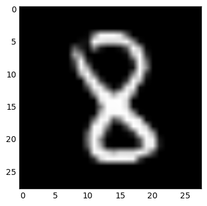

# MNIST image classification

This is a course task for *Artificial Intelligence* class at SPBU Applied Math department  

### Problem statement
(Full description could be found in pdf) 
With a given set of handwritten numbers predict what number is it.  
  
Thanks to [Michael A. Nielsen, "Neural Networks and Deep Learning", Determination Press, 2015](http://neuralnetworksanddeeplearning.com/index.html)
